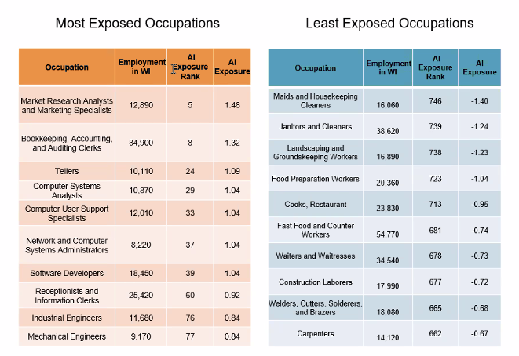
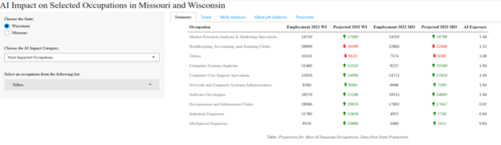
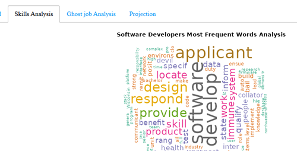
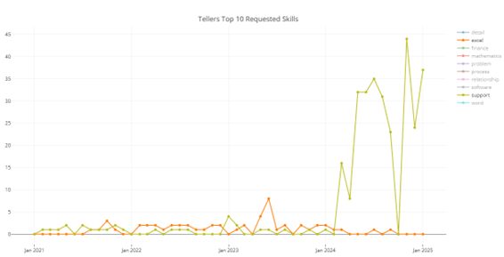
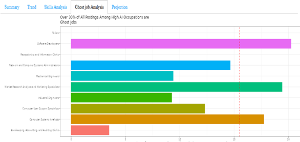
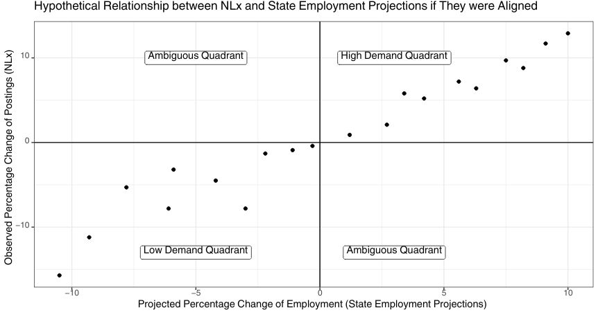
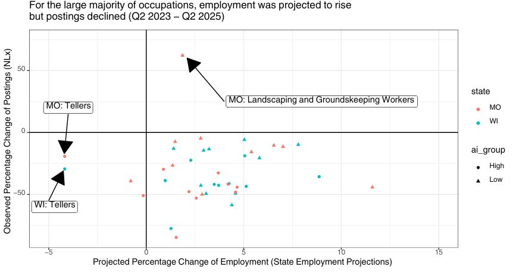

## **Measuring demand of occupations identified as having high and low risk of AI exposure**

### Authors

Ryan Long, Wisconsin Department of Workforce Development

Sawyer Meisel, Wisconsin Department of Workforce Development

Laura Lester, Missouri Department of Higher Education and Workforce Development

Nan Urbonya, Missouri Department of Higher Education and Workforce Development

Dr. Zeshan Hyder, Missouri Department of Higher Education and Workforce Development

### Introduction

An ever-evolving research has been going on the impact of Artificial Intelligence (AI) on the labor market. As we were looking up for a project for exploring and using National Labor Exchange (NLX)'s job data, we found four research papers that were focused on AI and its impact on occupations. These papers were'

-   Felten, Edward W., Manav Raj, and Robert Seamans. 2018. "A Method to Link Advances in Artificial Intelligence to Occupational Abilities." AEA Papers and Proceedings 108: 54-57.
-   Brynjolfsson, Erik, Tom Mitchell, and Daniel Rock. 2018. "What Can Machines Learn, and What Does It Mean for Occupations and the Economy?" *AEA Papers and Proceedings* 108: 43-47**.**
-   Meindl, B., Frank, M.R., & Mendonça, J. (2021). Exposure of occupations to technologies of the fourth industrial revolution. ArXiv, abs/2110.13317.
-   Webb, Michael, The Impact of Artificial Intelligence on the Labor Market (November 6, 2019). Available at SSRN: <https://ssrn.com/abstract=3482150> or <http://dx.doi.org/10.2139/ssrn.3482150>

Brynjolfsson et al. (2019) applied a 23-question rubric to evaluate how suitable 2,069 detailed work activities (DWAs) are for machine learning. Felten et al. (2019) used 16 Electronic Frontier Foundation (EFF) AI categories mapped to 52O\*NET Abilities (relative impact across all abilities aggregated at the occupation level). Webb (2020) and Meindl et al. (2021) used NLP methods to link patent descriptions to task descriptions (relevant patents per task). During a project in Wisconsin, [Wisconsin's taskforce on artificial intelligence (AI)](https://dwd.wisconsin.gov/ai-taskforce/) applied four AI Exposure measures to each occupation. These were then normalized by converting to a Z score. The median Z score across four measures for each occupation was then used to determine AI exposure of these occupations. For example, High exposure of 1.9 for *Bookkeeping, Accounting and Auditing Clerks* and a Low index of -2.4for *Slaughterers and Meat Packers.*

From that study, we used a list of 10 most exposed and 10 least exposed AI occupations to study the job postings, employment, wages, projections, and skills trends for these occupations using NLX's job postings data supplemented with Occupational Employment and Wages Statistics (OEWS) data and States' projections data for these selected occupations.

### The Data

We used following datasets for our project.

-   NLX's Job Posting data (the main dataset)
-   Occupations list from Wisconsin's taskforce on artificial intelligence (AI)
-   Occupational Employment and Wages Statistics (OEWS)
-   States' employment projections data
-   O'NET/SOC data

The list of occupations used in our study is attached as follows

### Methodology

Based on the above-mentioned datasets, we explored trends in job postings over time to see if there was any difference in the postings for Most and Least exposed AI occupations and if there was any correlation between AI exposure index and job postings. We also used projections models to see if the projected postings were aligning with the posted postings in the dataset. Using the job descriptions column of the data table, we utilized natural language processing and text mining models to extract most common skills demanded in these job postings and if there was any trends in the skills demands for these two groups of occupations (Most and Least Exposed AI occupations).

We also developed a dashboard that presented data and visualization/graphs showing trends in job postings, skills analysis using trend and word cloud, analyzing Ghost Jobs, showing projections models and the postings trends and States's projections data summary. The dashboard is accessible at <https://jrtresearchandconsulting.shinyapps.io/request/>.

{width="669"}

{width="645"}

### Key Findings

-   There were similar trends in postings for both group
-   There is still a demand for these occupations and AI is not a replacement for workers
-   Nature of work may change as AI evolves and new skills or clusters of skills may emerge as a demand for occupations exposed to AI.
-   There is a need of more skills analysis as well as how skills will change as AI becomes more prevalent
-   Occupations with high AI exposure tended to have a much higher share of postings accounted for by Ghost Jobs relative to occupations with low AI exposure

### Caveats

-   Correlation does not equal causation
-   Bias in online job postings
-   Time Constraints
-   Text Mining can be tricky - hard to capture everything
-   It is currently not recommended to filter out Ghost Jobs at the state level

### Possible Extensions

-   Further exploration of Skills data for occupations
-   Analyze more occupations beyond those selected for this project
-   Continue exploring NLX data and see how it compares and augments or replaces 3rd party online job postings data sources.
-   Further exploration of AI exposure indexes and refinement of exposure impacts on labor market and occupations.
-   Repeat the alignment analysis between state projections and NLx for different time periods (e.g. 2017-19) to see if 2023-25 is a "unique" period

### References

-   Brynjolfsson, E., Mitchell, T., & Rock, D. (2018). What Can Machines Learn and What Does It Mean for Occupations and the Economy? *AEA Papers and Proceedings*, *108*, 43-47. <https://doi.org/10.1257/pandp.20181019>
-   Felten, E. W., Raj, M., & Seamans, R. (2018). A Method to Link Advances in Artificial Intelligence to Occupational Abilities. *AEA Papers and Proceedings*, *108*, 54-57. <https://doi.org/10.1257/pandp.20181021>
-   Meindl, B., Frank, M. R., & Mendonça, J. (2021). *Exposure of occupations to technologies of the fourth industrial revolution* (No. arXiv:2110.13317). arXiv. <https://doi.org/10.48550/arXiv.2110.13317>
-   Webb, M. (2019a). *The Impact of Artificial Intelligence on the Labor Market* (SSRN Scholarly Paper No. 3482150). Social Science Research Network. <https://doi.org/10.2139/ssrn.3482150>
